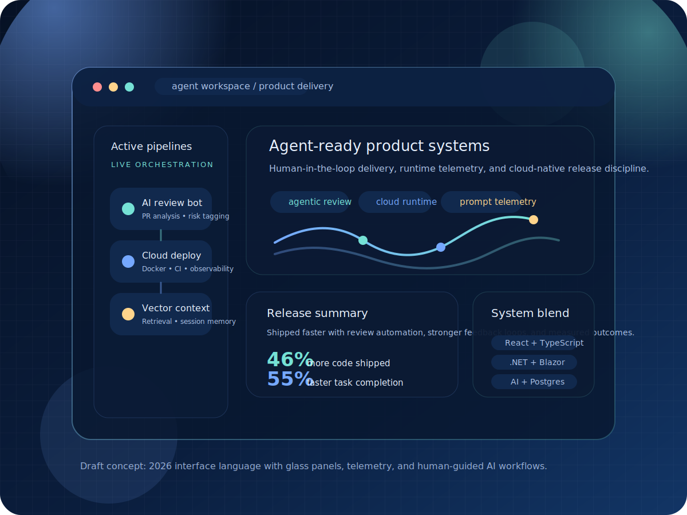
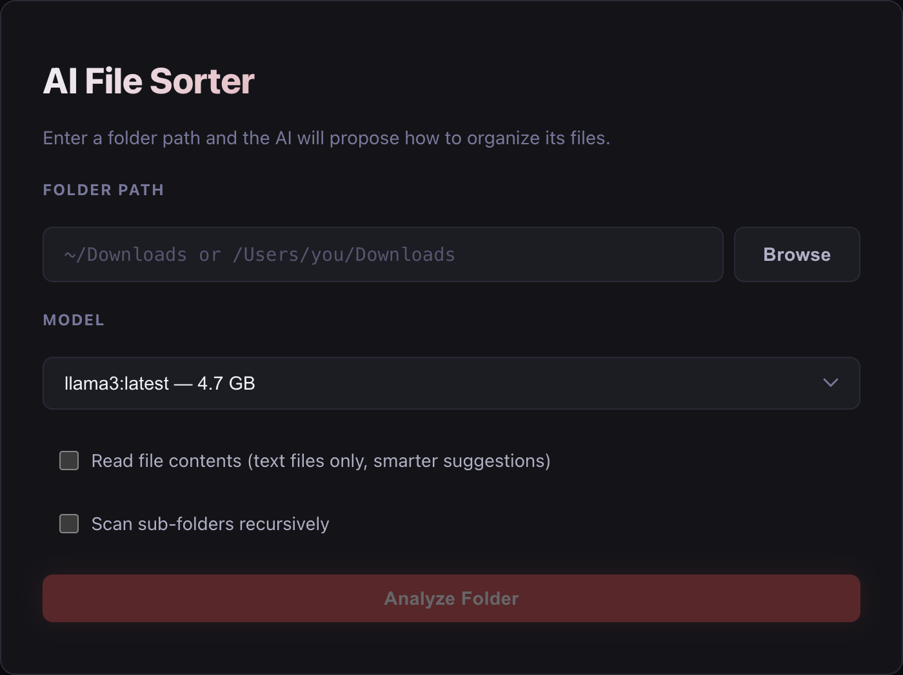
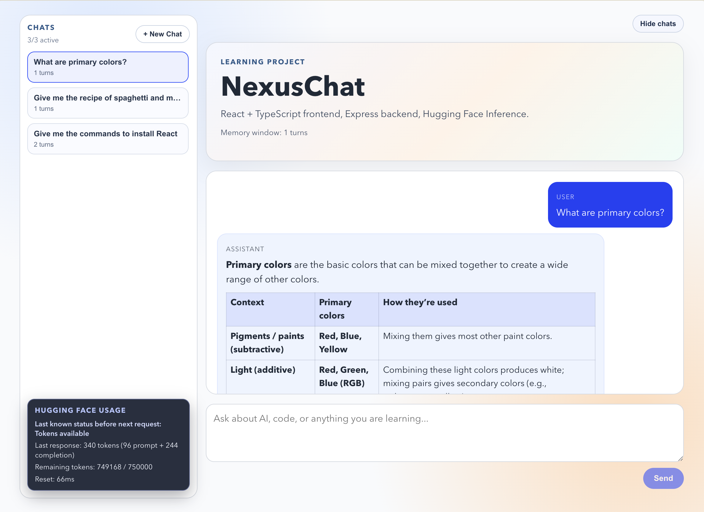

# Rajat Gedam Portfolio

Modern single-page portfolio for Rajat Gedam, built with React, TypeScript, and Vite, then deployed to GitHub Pages.

Live site: https://rajatgedam.github.io/

## Preview



## Featured Work Preview

### AI File Sorter



### AI Chat Bot (NexusChat)



## Overview

This repository contains the rebuilt portfolio site for Rajat Gedam. The previous CRA-based portfolio was preserved in backup folders, and the live app was rebuilt as a data-driven single-page experience focused on maintainability, GitHub Pages deployment, and stronger presentation of enterprise and AI-focused work.

The current site includes:

- A responsive single-page layout with anchored navigation
- Background particle animation with reduced-motion support
- Typed content modules for profile, experience, and projects
- Resume download support from public assets
- Archived project toggle for older work
- GitHub Actions deployment to the gh-pages branch

## Tech Stack

- React 19
- TypeScript 6
- Vite 8
- Tailwind CSS 4 via the Vite plugin
- Framer Motion
- tsParticles
- Lucide React
- ESLint with typescript-eslint
- GitHub Actions for CI/CD

## Site Sections

The portfolio renders these primary sections:

- Home
- About
- Experience
- Projects
- Contact

Display details currently implemented:

- Sticky desktop navigation with active-section highlighting
- Mobile navigation drawer
- Hero section with illustration and resume CTA
- Experience timeline cards driven from typed data
- Project cards driven from typed data
- Show or hide archived projects without editing component logic
- Contact area with email, phone, resume, GitHub, and LinkedIn links

## Content Source of Truth

The site is intentionally data-driven. Most portfolio updates should be made in the data files instead of inside components.

- `src/data/profile.ts`: personal summary, headline, quick facts, skills, contact info, social links, resume URL
- `src/data/experience.ts`: work history, bullets, dates, locations, tools
- `src/data/projects.ts`: featured and archived projects, descriptions, links, screenshots, technologies
- `src/types/portfolio.ts`: shared TypeScript interfaces for the content model

## Current Portfolio Content

The site currently reflects:

- Updated professional summary aligned with the latest resume
- Experience at Deloitte, University of Massachusetts, and Yardi Systems
- AI File Sorter and AI Chat Bot as current highlighted projects
- Archived academic and earlier portfolio projects behind a toggle
- Resume asset exposed at `/assets/resume/RajatGedamResume.pdf`

## Local Development

Install dependencies:

```bash
npm install
```

Start the Vite development server:

```bash
npm run dev
```

Run the main validation commands:

```bash
npm run lint
npm run typecheck
npm run build
```

Preview the production build locally:

```bash
npm run preview
```

## Available Scripts

- `npm run dev`: start the local development server
- `npm run build`: run TypeScript build checks and create the production bundle
- `npm run typecheck`: run TypeScript project validation without emitting output
- `npm run lint`: run ESLint across the project
- `npm run preview`: serve the built `dist/` output locally
- `npm run deploy`: local manual deployment helper using `gh-pages`

## Deployment

Deployment is automated with GitHub Actions.

Workflow summary:

- Trigger: push to `main` or manual workflow dispatch
- Runtime: Ubuntu runner with Node.js 24
- Install step: `npm ci`
- Verification steps: `npm run lint`, `npm run typecheck`, `npm run build`
- Publish target: `gh-pages` branch

The production build uses `VITE_BASE_PATH`, which is currently set to `/` in CI for the GitHub Pages deployment used by this repository.

## Project Structure

```text
.
├── .github/workflows/deploy.yml
├── public/
│   └── assets/
├── src/
│   ├── components/
│   │   ├── common/
│   │   └── sections/
│   ├── data/
│   ├── types/
│   ├── App.tsx
│   ├── index.css
│   └── main.tsx
├── backup/
│   ├── legacy/
│   └── original/
├── package.json
└── README.md
```

## Asset Notes

- Project screenshots are served from `public/assets/projects/`
- Resume assets are served from `public/assets/resume/`
- The hero illustration is served from `public/assets/illustrations/`

When adding new project screenshots, place them under `public/assets/projects/` and reference them in `src/data/projects.ts`.

## Legacy Backup Notes

This repository contains preserved legacy material so the previous portfolio implementation is still available for reference.

- `backup/legacy/`: tracked legacy CRA files moved out of the active app source tree
- `backup/original/`: original backup snapshot kept out of the active workflow

These folders are excluded from the active lint and build path so the new Vite application stays isolated from the old codebase.

## Maintenance Guide

Common updates usually happen here:

- Change intro, skills, resume link, or contact info in `src/data/profile.ts`
- Add or edit experience entries in `src/data/experience.ts`
- Add featured or archived projects in `src/data/projects.ts`
- Replace screenshots in `public/assets/projects/`
- Update visual system and layout styling in `src/index.css`
- Update top-level composition and section order in `src/App.tsx`

For new archived projects, set `archived: true` in the relevant project object. The UI already knows how to place those behind the archived-project toggle.

## Validation Status

The current project setup has been validated locally with:

- `npm ci`
- `npm run lint`
- `npm run typecheck`
- `npm run build`

## Notes

- The portfolio was migrated from an older React/SASS setup to a React/TypeScript/Vite architecture.
- CI dependency resolution was stabilized for GitHub Actions by explicitly pinning `@emnapi/core` and `@emnapi/runtime` in devDependencies.
- This README documents both the display purpose of the portfolio and the maintenance workflow for future updates.
